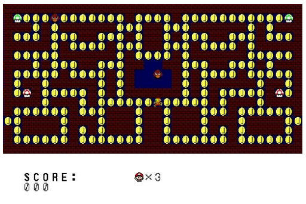

# Comecocos

## Introduction
This project involves implementing a version of the iconic Pac-Man video game to explore and apply key concepts of hardware description on an FPGA platform.

## Languages and tools
This project has been developed using:
- VHDL.
- VIVADO Design Suite.
- Timing and constraing tools (.xdc files)

## Hardware
- FPGA (Basys 3).
- VGA Output.
- Button Input.
- Clock divider and timing signals.

## Concepts applied
In the project, there are several important concepts that have been applied, such as:
- The design of efficients **Finite State Machines**.
- Clean and commented code for better readability and understanding.
- An efficient use of the FPGA resources.
- Modular design to improve scalability and code reusability.
- Memory mapping and video signal generation for visual output.
- Pixel-based graphics control using VGA.
- Testing and simulation of components using testbenches.
- Top-down design methodology, starting from high-level architecture down to low-level modules.

## Preview

Here you can see how the game is when running in a screen.

Even though is played like a Pac-Man game, the style is like a Mario Bros game, with all the sprites made by hand.

As additional information, the game includes:
- A complete working system of 3 lives.
- A system of punctuation where the coins count as 1 points, the red mushroom as 3 points and the green mushroom as 6 points.
- A rotation of the sprite depending on the direction of the movement using the same memory block.
- A pseudo-random code generator for the enemy movement.

